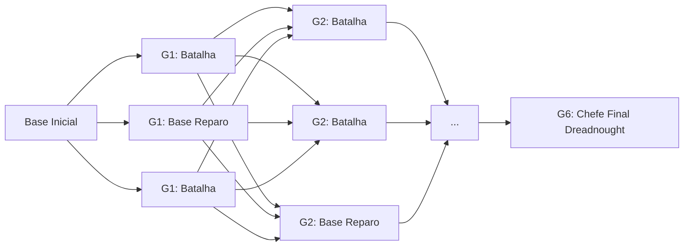
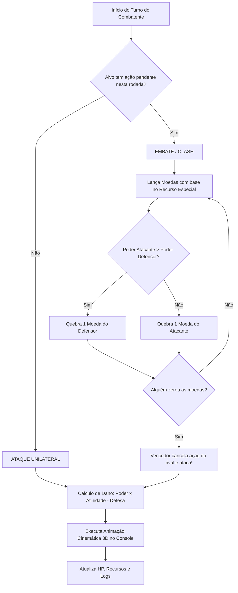
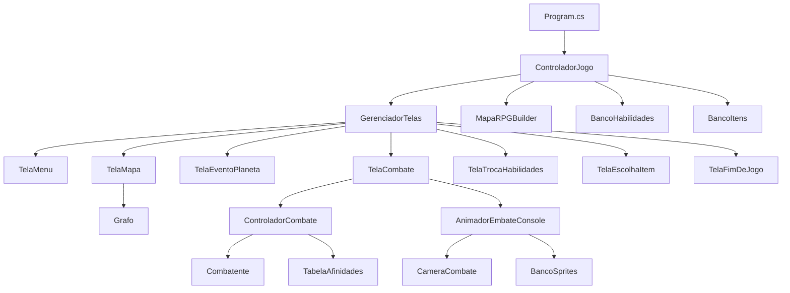

# 🚀 DOCUMENTAÇÃO COMPLETA DA ARQUITETURA E SISTEMAS DO JOGO
## *Mercenários do Éter: A Escolta da Carga 73* — RPG Tático Espacial em C# (.NET 10)

---

## 📑 ÍNDICE
1. [Visão Geral e Contexto Temático](#1-visão-geral-e-contexto-temático)
2. [Arquitetura Geral e Estrutura de Diretórios](#2-arquitetura-geral-e-estrutura-de-diretórios)
3. [Padrões de Projeto (Design Patterns) Implementados](#3-padrões-de-projeto-design-patterns-implementados)
4. [Lógicas e Funcionamento dos Sistemas em Detalhes](#4-lógicas-e-funcionamento-dos-sistemas-em-detalhes)
   - 4.1. [Sistema de Exploração Espacial e Grafo de Galáxias](#41-sistema-de-exploração-espacial-e-grafo-de-galáxias)
   - 4.2. [Sistema de Combate Tático 3v3 (Inspirado em Limbus Company)](#42-sistema-de-combate-tático-3v3-inspirado-em-limbus-company)
   - 4.3. [Sistema de Classes, Heróis e Recursos Únicos](#43-sistema-de-classes-heróis-e-recursos-únicos)
   - 4.4. [Sistema de Habilidades, Moedas e Decks](#44-sistema-de-habilidades-moedas-e-decks)
   - 4.5. [Sistema de Afinidades Elementares (Matriz Triangular)](#45-sistema-de-afinidades-elementares-matriz-triangular)
   - 4.6. [Sistema de Itens, Inventário e Coleta de Espólios (Loot)](#46-sistema-de-itens-inventário-e-coleta-de-espólios-loot)
   - 4.7. [Sistema de Áreas de Descanso e Gestão de Habilidades](#47-sistema-de-áreas-de-descanso-e-gestão-de-habilidades)
   - 4.8. [Motor Gráfico de Console, Câmera 3D e Animações Cinematográficas](#48-motor-gráfico-de-console-câmera-3d-e-animações-cinematográficas)
   - 4.9. [Sistema de Áudio Chiptune em Console](#49-sistema-de-áudio-chiptune-em-console)
5. [Estratégias de Integração entre Sistemas](#5-estratégias-de-integração-entre-sistemas)
6. [Pilares de POO e Princípios SOLID Aplicados](#6-pilares-de-poo-e-princípios-solid-aplicados)
7. [Fluxo de Execução Completo da Aplicação](#7-fluxo-de-execução-completo-da-aplicação)

---

## 1. Visão Geral e Contexto Temático

### 1.1. Premissa Narrativa
Em um quadrante remoto da galáxia dominado pelo tirânico **Sindicato Estelar**, uma tripulação de três mercenários veteranos a bordo da nave estelar **Vanguarda** é contratada para uma missão de alto risco: escoltar e transportar um compartimento criogênico contendo uma pessoa misteriosa identificada apenas como **Carga 73**. 

O objetivo da campanha é atravessar **6 Galáxias interconectadas** através de saltos hiperespaciais por rotas estelares, enfrentando patrulhas hostis, enxames de drones de combate e navios de guerra capitânia, até alcançar o ponto de evacuação com a Aliança Livre e derrotar o Dreadnought Titã no confronto final.

### 1.2. Inspirações Mecânicas Centrais
* **Navegação Não-Linear em Grafo (*Slay the Spire / FTL: Faster Than Light*)**: O jogador navega por nós com múltiplas escolhas de rota, onde cada nó representa um planeta ou estação espacial com eventos procedurais, áreas de descanso ou combates com inimigos de nível progressivo.
* **Combate Tático com Mecânica de Moedas e Embates (*Limbus Company*)**: Batalha em turnos 3v3 onde as ações são decididas por ordem de Agilidade, os inimigos revelam antecipadamente suas intenções e alvos, e os ataques colidentes resultam em **Embates (Clashes)** resolvidos pelo sorteio de moedas condicionadas aos recursos psicológicos e fisiológicos de cada classe.
* **Sistema Triangular de Afinidades**: Combinações estritas de fraquezas e resistências entre atributos de ataque (*Fogo, Elétrico, Ácido*) e blindagens defensivas (*Armadurado, Mecânico, Biológico*).

---

## 2. Arquitetura Geral e Estrutura de Diretórios

O projeto adota uma arquitetura em camadas orientada a objetos (POO), desacoplando o modelo de domínio (*Model*), o fluxo de telas e controle (*Controladores*) e a apresentação gráfica no terminal (*Telas e RenderizadorUI*).

```
ProjetoFinalPOO/
├── Program.cs                  # Ponto de entrada (Main), bootstrap e captura de exceções globais
├── Controladores/              # Orquestração do ciclo de vida do jogo
│   └── ControladorJogo.cs
├── Dados/                      # Arquivos de configuração JSON externos
│   ├── configuracoes.json      # Parâmetros globais, resolução e taxas
│   ├── habilidades.json        # Decks completos de heróis e inimigos
│   ├── inimigos.json           # Arquétipos e parâmetros de escalonamento
│   └── itens.json              # Catálogo de consumíveis e espólios
├── Data/                       # Repositórios e carregador dinâmico de dados
│   ├── CarregadorDadosJogo.cs  # Motor de desserialização com fallback seguro
│   ├── BancoItens.cs           # Catálogo de consumíveis e gerador de espólios
│   └── BancoHabilidades.cs     # Fábrica de cartas e heróis com decks iniciais
├── Domain/                     # Camada de Domínio e Regras de Negócio
│   ├── Combate/                # Motor de combate, slots táticos e embates
│   │   ├── ControladorCombate.cs
│   │   ├── ResultadoEmbate.cs
│   │   ├── Slot.cs
│   │   └── IObservadorCombate.cs
│   ├── Combatentes/            # Entidades dos combatentes (Aliados e Inimigos)
│   │   ├── Combatente.cs
│   │   ├── Sentinela.cs
│   │   ├── Engenheiro.cs
│   │   ├── Biomancer.cs
│   │   └── Inimigo.cs
│   ├── Encontros/              # Padrão Strategy para encontros planetários
│   │   ├── IEncontro.cs
│   │   ├── Encontro.cs
│   │   ├── EncontroBatalha.cs
│   │   └── EncontroBaseEspacial.cs
│   ├── Excecoes/               # Exceções de regras de domínio
│   │   └── RegraJogoException.cs
│   ├── Habilidades/            # Entidade de cartas e matriz de efetividade
│   │   ├── Habilidade.cs
│   │   └── TabelaAfinidades.cs
│   ├── Itens/                  # Consumíveis e efeitos aplicáveis
│   │   ├── Item.cs
│   │   └── IAplicavelEfeito.cs
│   └── Mapa/                   # Grafo estelar, vértices, arestas e builder
│       ├── Grafo.cs
│       ├── Vertice.cs
│       ├── Aresta.cs
│       ├── Mapa.cs
│       └── MapaRPGBuilder.cs
├── Enums/                      # Enumerações compartilhadas
│   ├── Afinidade.cs
│   ├── AfinidadeAtaque.cs
│   ├── AfinidadeDefesa.cs
│   ├── CategoriaHabilidade.cs
│   ├── ClasseCombatente.cs
│   ├── OpcaoMenuCombate.cs
│   ├── OpcaoMenuPrincipal.cs
│   ├── Raridade.cs
│   ├── TipoCarta.cs
│   ├── TipoEncontro.cs
│   └── TipoItem.cs
├── Media/                      # Áudio e sintetizador
│   └── Audio/
│       ├── Nota.cs
│       ├── Musica.cs
│       └── BibliotecaDeMusicas.cs
├── Presentation/               # Camada de Apresentação (Interface Console)
│   ├── Engine/                 # Renderizador gráfico, sprites, câmera e animação
│   │   ├── ConfiguradorTela.cs
│   │   ├── RenderizadorUI.cs
│   │   ├── BancoSprites.cs
│   │   ├── CameraCombate.cs
│   │   └── AnimadorEmbateConsole.cs
│   └── Telas/                  # Telas interativas e gerenciamento de fluxo
│       ├── ITela.cs
│       ├── GerenciadorTelas.cs
│       ├── ControladorTela.cs
│       ├── TelaMenu.cs
│       ├── TelaMapa.cs
│       ├── TelaCombate.cs
│       ├── TelaEventoPlaneta.cs
│       ├── TelaTrocaHabilidades.cs
│       ├── TelaEscolhaItem.cs
│       ├── TelaOpcoes.cs
│       ├── TelaCreditos.cs
│       ├── TelaCarregarJogo.cs
│       └── TelaFimDeJogo.cs
└── ProjetoFinalPOO.csproj      # Configuração do projeto .NET 10
```

---

## 3. Padrões de Projeto (Design Patterns) Implementados

A arquitetura do jogo apoia-se em múltiplos padrões de projeto consagrados pelo *Gang of Four (GoF)*:

| Padrão de Projeto | Tipo | Classe / Localização | Objetivo e Benefício na Arquitetura |
| :--- | :--- | :--- | :--- |
| **Singleton** | Criacional | `GerenciadorTelas.Instancia`<br>`ControladorCombate.Instancia()`<br>`Sentinela.Instancia()`<br>`Engenheiro.Instancia()`<br>`Biomancer.Instancia()` | Garante instância única global para o gerenciamento de telas, motor de regras de combate e retenção de estado persistente (HP, EXP, modificadores) da tripulação mercenária. |
| **Builder** | Criacional | `MapaRPGBuilder` | Permite a construção fluente e controlada do Grafo de 6 galáxias (`.GerarInicio().AdicionarGalaxia(1)...AdicionarGalaxia(6).Construir()`), encapsulando a interligação de nós e distribuição equilibrada de encontros. |
| **Factory Method / Static Factory** | Criacional | `ControladorTela`<br>`BancoHabilidades`<br>`BancoItens` | Centraliza a instanciação de telas, combatentes com seus decks pré-configurados e espólios de itens, desacoplando os controladores das implementações concretas. |
| **State / Stack-based Screen** | Comportamental | `GerenciadorTelas` & `ITela` | Gerencia a pilha e o ciclo de vida das telas ativas (`Entrar()`, `Atualizar()`, `Renderizar()`, `Sair()`), viabilizando transições suaves e telas sobrepostas (modais/menus). |
| **Strategy** | Comportamental | `IEncontro` (`EncontroBatalha`, `EncontroBaseEspacial`)<br>`IAplicavelEfeito` (`Item`) | Modela o comportamento polimórfico dos nós do mapa e a execução de efeitos dinâmicos de consumíveis sem acoplamento condicional rígido. |
| **Observer** | Comportamental | `IObservadorCombate` | Estabelece um contrato desacoplado para notificação de atualizações de estado do combate, logs de telemetria e resultados de embates para a interface visual. |
| **MVC / MVP** | Arquitetural | `Combatente/Habilidade/Grafo` (Model)<br>`ControladorJogo/Combate` (Controller)<br>`TelaCombate/RenderizadorUI` (View) | Separa com rigor a lógica de negócio (cálculos de dano, moedas, matrizes) da representação visual em caracteres no terminal. |

---

## 4. Lógicas e Funcionamento dos Sistemas em Detalhes

### 4.1. Sistema de Exploração Espacial e Grafo de Galáxias
O universo é estruturado como um **Grafo Direcionado Ponderado**:
* **Vértices (`Vertice`)**: Representam corpos celestes, estações orbitais e fendas espaciais. Cada vértice possui um nome único (ex: `"Galáxia 2, Planeta 3"`), uma lista de arestas de saída e um objeto `Encontro` associado.
* **Arestas (`Aresta`)**: Representam hipervias navegáveis de dobra espacial com um custo de combustível/unidades de Éter (`Peso`).
* **Estrutura em 6 Galáxias**:
  1. *Nó Inicial (`Inicio`)*: Estação orbital de lançamento da nave Vanguarda.
  2. *Galáxias 1 a 5*: Cada galáxia gera 3 nós orbitais. Em cada galáxia, 1 nó é sorteado proceduralmente como uma **Base Espacial / Área de Descanso**, enquanto os outros 2 são **Encontros de Combate**.
  3. *Interligação Completa*: Todos os 3 planetas da galáxia anterior conectam-se aos 3 planetas da galáxia seguinte, garantindo total liberdade estratégica de escolha de rota ao jogador.
  4. *Galáxia 6 (Chefe Final)*: Fortaleza Dreadnought da Frota Sindical, culminando no combate decisivo.
* **Navegação e Interface**: A `TelaMapa` renderiza o diagrama estelar em ASCII, destacando o planeta atual da nave `[>> VANGUARDA <<]`, o histórico de voo percorrido, as rotas disponíveis e um scanner holográfico do setor selecionado.



---

### 4.2. Sistema de Combate Tático 3v3 (Inspirado em Limbus Company)

O combate desenrola-se em uma arena tática de 3 Combatentes Aliados contra até 3 Combatentes Inimigos posicionados em `Slot`s táticos.

#### Fluxo de uma Rodada de Combate:
1. **Cálculo da Iniciativa por Agilidade**:
   No início da rodada (`ControladorCombate.IniciarRodada()`), todos os combatentes vivos de ambos os lados são ordenados de forma decrescente pela sua `Agilidade`:
   $$\text{Ordem} = \text{OrderByDescending}(\text{Combatente.Agilidade})$$
2. **Declaração e Previsão de Intenções dos Inimigos (Preview)**:
   A IA inimiga seleciona previamente qual habilidade usará e qual aliado pretende atacar. Essa informação é exibida nos cards dos inimigos na UI, permitindo ao jogador planejar defesas e interceptações estratégicas.
3. **Turno de Decisão do Jogador**:
   Quando chega a vez de um aliado na fila de iniciativa, o jogador possui 3 opções:
   - **[1] Atacar com Habilidade**: Escolhe 1 entre as cartas equipadas do herói e seleciona o alvo inimigo.
   - **[2] Usar Item do Inventário**: Consome um item da nave (cura, recarga de recursos, granadas de dano direto).
   - **[3] Postura Defensiva**: O herói entra em guarda defensiva, restaurando +5% de HP, dobrando a absorção de defesa e recuperando seu modificador especial.
4. **Resolução de Conflitos: Embate (Clash) vs Ataque Unilateral**:
   - **Cenário A: O Inimigo Alvo Possui Ação Pendente $\rightarrow$ EMBATE (CLASH)**:
     Ocorre um confronto direto entre a habilidade do aliado e a habilidade declarada do inimigo.
     Ambos os combatentes lançam suas **Moedas**. O poder final de cada um é calculado somando o poder base aos bônus das moedas que deram "cara" (sucesso).
     O combatente com maior poder vence o round do embate e **destrói uma moeda da habilidade do oponente**.
     Esse processo repete-se em loop até que um dos combatentes perca todas as suas moedas. O perdedor tem sua ação completamente cancelada e sofre o ataque completo do vencedor.
   - **Cenário B: O Inimigo Alvo Já Agiu ou Não Possui Oposição $\rightarrow$ ATAQUE UNILATERAL**:
     O atacante desfere seu golpe sem disputa de moedas. O dano é aplicado diretamente sobre o alvo com base na fórmula de afinidade e defesa.



---

### 4.3. Sistema de Classes, Heróis e Recursos Únicos

Cada membro da tripulação possui uma identidade de jogo profunda, blindagem elemental e uma mecânica exclusiva de modificador que afeta as probabilidades de sucesso no lançamento das moedas:

#### 1. Sentinela — *Optimus*
* **Perfil**: Vanguarda blindada de alta resistência e impacto físico pesado.
* **Afinidade Defensiva**: `AfinidadeDefesa.Armadurado` (Altamente resistente a Fogo, imune a impactos normais, fraco contra Ácido).
* **Atributos Base**: Vida: 100 | Defesa: 10 | Agilidade: 8.
* **Recurso Exclusivo — Adrenalina (0 a 45)**:
  - Acumula adrenalina ao receber dano ($+\frac{\text{Dano}}{2}$) e ao adotar Postura Defensiva ($+5\%$).
  - **Efeito no Embate**: A probabilidade de obter sucesso em cada moeda é governada por:
    $$\text{Sucesso} \iff \text{Random}(\text{Adrenalina}, 100) > 50$$
    Quanto mais ferido e pressionado em batalha, maior a Adrenalina de Optimus, tornando seus embates praticamente infalíveis.

#### 2. Engenheiro — *Asimov*
* **Perfil**: Especialista tático em alta tecnologia, armas eletrostáticas e ataques de precisão em alta velocidade.
* **Afinidade Defensiva**: `AfinidadeDefesa.Mecanico` (Resistente a Ácido, fraco contra descargas Elétricas).
* **Atributos Base**: Vida: 70 | Defesa: 13 | Agilidade: 20 (Geralmente age primeiro no turno).
* **Recurso Exclusivo — Superaquecimento (0 a 45)**:
  - Aumenta conforme utiliza circuitos pesados e calibra defesas.
  - **Efeito no Embate**: Utiliza o calor dos capacitores para turbinar as chances de acerto das moedas de choque elétrico.

#### 3. Biomancer — *Pasteur*
* **Perfil**: Ocultista biológico e manipulador de enzimas cáusticas e reações térmicas celulares.
* **Afinidade Defensiva**: `AfinidadeDefesa.Biologico` (Resistente a Choque Elétrico, vulnerável a Fogo).
* **Atributos Base**: Vida: 50 | Defesa: 8 | Agilidade: 15.
* **Recurso Exclusivo — Mana (0 a 45)**:
  - Inicia a batalha com **Mana Máxima (45)**. Consome mana ao desferir magias avançadas e recupera $+30\%$ de mana ao utilizar a Postura Defensiva.
  - **Efeito no Embate**: Enquanto sua mana permanecer alta, Pasteur tem máxima probabilidade de sucesso em suas moedas de ataque corrosivo e pirocinético.

---

### 4.4. Sistema de Habilidades, Moedas e Decks

Cada habilidade de combate (`Habilidade`) é modelada com 8 propriedades essenciais:
1. `Id`: Identificador único.
2. `Nome` e `Descricao`: Nome tático e descrição de lore.
3. `Categoria`: `Basica`, `Avancada` ou `Especialista`.
4. `Modificador`: Quantidade de recurso (Adrenalina, Superaquecimento ou Mana) adicionada ou subtraída.
5. `Afinidade`: `AfinidadeAtaque.Fogo`, `AfinidadeAtaque.Eletrico` ou `AfinidadeAtaque.Acido`.
6. `PoderBase`: Valor numérico garantido de poder da habilidade.
7. `Moeda`: Quantidade de moedas que a habilidade arremessa no embate (1 a 3 moedas).
8. `PoderAdicionalMoeda`: Valor adicional somado ao poder para cada moeda vencedora.

#### Regra de Estrutura do Deck por Combatente (README 27):
Todo personagem possui um conjunto de exatamente **6 Habilidades**:
* **3 Habilidades Básicas**: Custo baixo/nulo, geração sustentável de recursos, 1 a 2 moedas.
* **2 Habilidades Avançadas**: Alto valor de choque, 2 a 3 moedas, maior poder adicional.
* **1 Habilidade Especialista (Ultimate)**: Ataque devastador com 3 moedas de alto calibre e efeitos decisivos.

---

### 4.5. Sistema de Afinidades Elementares (Matriz Triangular)

O combate implementa uma matriz estrita de vantagens e vulnerabilidades elementares (`TabelaAfinidades`):

| Afinidade de Ataque \ Blindagem de Defesa | Armadurado (Optimus) | Mecânico (Asimov) | Biológico (Pasteur) |
| :--- | :---: | :---: | :---: |
| **Ácido (Corrosivo)** | **2.0x (Fraqueza Crítica)** | 0.5x (Resistente) | 1.0x (Neutro) |
| **Elétrico (Sobrecarga)** | 1.0x (Neutro) | **2.0x (Fraqueza Crítica)** | 0.5x (Resistente) |
| **Fogo (Térmico)** | 0.5x (Resistente) | 1.0x (Neutro) | **2.0x (Fraqueza Crítica)** |

#### Fórmula Definitiva de Cálculo de Dano:
$$\text{DanoFinal} = \left( \text{PoderFinal} \times \text{MultiplicadorAfinidade} \right) - \text{DefesaEfetiva}$$
* Onde:
  $$\text{DefesaEfetiva} = \begin{cases} 2 \times \text{Defesa do Alvo}, & \text{se o alvo estiver em Postura Defensiva} \\ \text{Defesa do Alvo}, & \text{caso contrário} \end{cases}$$
* Regra de Dano Mínimo: Se o ataque acertar e o cálculo resultar em $\le 0$, o dano final é ajustado para **1 HP**.

---

### 4.6. Sistema de Itens, Inventário e Coleta de Espólios (Loot)

* **Polimorfismo com `IAplicavelEfeito`**: Os itens implementam a interface de efeito direto, aplicando cura, recuperação de recursos especiais, barreiras cinéticas ou granadas de dano elemental direto em alvos inimigos.
* **Raridades**: `Comum`, `Incomum`, `Raro`, `Epico`, `Lendario`.
* **Mecânica de Espólio (README 22)**:
  Ao explorar nós planetários, o sistema aciona `TelaEscolhaItem`, que sorteia **3 itens distintos** do catálogo global do `BancoItens`. O jogador deve analisar suas necessidades táticas e escolher **1 item** para incorporar ao inventário permanente da nave Vanguarda.

---

### 4.7. Sistema de Áreas de Descanso e Gestão de Habilidades

Nas **Bases Espaciais** (nós seguros do mapa):
1. **Recuperação da Nave e Tripulação**: Restaura vida e integridade estrutural.
2. **Troca de Habilidades (`TelaTrocaHabilidades`)**: O jogador tem acesso a todo o compêndio de habilidades do jogo e pode personalizar os decks de Optimus, Asimov e Pasteur, respeitando o limite de 3 Básicas, 2 Avançadas e 1 Especialista.

---

### 4.8. Motor Gráfico de Console, Câmera 3D e Animações Cinematográficas

O jogo conta com um avançado motor de renderização construído sobre o terminal:
* **Projeção Perspectiva 3D/2.5D (`CameraCombate`)**:
  - Transforma coordenadas tridimensionais do mundo `Vetor3D(X, Y, Z)` para células discretas de caracteres no console `(TelaX, TelaY)`.
  - **Enquadramento Automático e Zoom**: Calcula dinamicamente o ponto médio entre o atacante e o defensor e ajusta a distância focal da câmera em função da proximidade dos dois.
  - **Interpolação Suave (Lerp com Damping Exponencial)**:
    $$PosX(t) = PosX + (AlvoX - PosX) \times (1 - e^{-\text{velocidade} \times dt})$$
  - **Screen Shake Físico com Decaimento**: Aplica vibração caótica nos eixos X e Y proporcional ao trauma de impacto do golpe, decaindo suavemente ao longo do tempo.
* **Buffer Duplo e Animação Frame-a-Frame (`AnimadorEmbateConsole`)**:
  - Mantém duas matrizes em memória: `char[altura, largura]` e `ConsoleColor[altura, largura]`.
  - Renderiza animações completas:
    - *Ataques Corporais*: Avanço em velocidade, choque no ponto médio, explosão de faíscas `'*'`, `'#'`, `'@'` e recuo tático.
    - *Ataques à Distância*: Mira, carregamento de energia, arco balístico do projétil viajando pelo cenário e impacto com fumaça e detritos.
    - *Suporte a Cancelamento Instantâneo*: O jogador pode pressionar qualquer tecla a qualquer momento para pular a animação.
* **Interface Semântica (`RenderizadorUI`)**:
  - Molduras com cantos arredondados, cards simultâneos com barras de vida em blocos ASCII `[████████░░]`, ícones de blindagem e destaques coloridos por afinidade elemental.

---

### 4.9. Sistema de Áudio Chiptune em Console

O subsistema de música (`ProjetoFinalPOO.Música`) utiliza o sintetizador de hardware do terminal (`Console.Beep(frequência, duração)`):
* `Nota`: Encapsula frequência em Hertz (ex: 523 Hz = Dó5, 659 Hz = Mi5, 784 Hz = Sol5, 1047 Hz = Dó6) e duração em milissegundos.
* `Musica`: Lista de notas executadas sequencialmente em thread com tratamento de exceções para compatibilidade multiplataforma (Linux/Windows).
* `BibliotecaDeMusicas`: Fornece temas para a Abertura da Campanha, Navegação e a Fanfarra de Conquista pós-batalha.

---

## 5. Estratégias de Integração entre Sistemas

A integração harmoniosa entre os subsistemas é orquestrada através de fronteiras bem delimitadas:



1. **Persistência de Estado na Expedição**:
   O `ControladorJogo` mantém a lista viva da `_tripulacao` e o `_inventarioEquipe`. Quando a nave salta no mapa, esses mesmos objetos de combatentes (com seu HP atual, EXP acumulada e habilidades) são passados para a `TelaEventoPlaneta` e para a `TelaCombate`, garantindo que danos sofridos persistam entre encontros.
2. **Desacoplamento por Fábrica (`ControladorTela`)**:
   Nenhum controlador precisa instanciar diretamente telas concretas com dependências pesadas; a fábrica cria as telas já configuradas com seus grafos, inventários e regras.
3. **Resolução Isolada de Regras de Combate (`ControladorCombate`)**:
   A `TelaCombate` não executa cálculos matemáticos de dano ou embates de moedas por conta própria; ela delega essa responsabilidade integralmente para o `ControladorCombate`, que retorna estruturas de dados `ResultadoEmbate` puras para serem animadas pelo `AnimadorEmbateConsole`.
4. **Tratamento de Exceções de Domínio**:
   O sistema possui a exceção customizada `RegraJogoException` para validações de parâmetros (como uso de itens nulos ou alvos inválidos) e proteções com blocos `try/catch` no `Program.cs` que restauram o terminal e o cursor mesmo em caso de falha crítica.

---

## 6. Pilares de POO e Princípios SOLID Aplicados

### 6.1. Pilares da Programação Orientada a Objetos
* **Abstração**: A classe abstrata `Combatente` define contratos e comportamentos genéricos para qualquer entidade de combate (`ReceberDano`, `Defender`, `CalcularPoderBase`), enquanto classes concretas implementam detalhes de domínio.
* **Encapsulamento**: Atributos críticos (como `VidaAtual`, `VidaTotal`, `Adrenalina`, `Sobreaquecimento`, `Mana`) possuem modificadores de acesso controlados com setters privados ou internos e validações estritas de limites ($0 \le \text{Vida} \le \text{VidaTotal}$).
* **Herança**: `Sentinela`, `Engenheiro`, `Biomancer` e `Inimigo` herdam de `Combatente`, reutilizando lógica de cálculo de dano, inventário de cartas e identificadores únicos.
* **Polimorfismo**:
  - `CalcularPoderBase` e `AlterarModificador` são sobrescritos (`override`) em cada subclasse para responder exclusivamente conforme a Adrenalina, Superaquecimento ou Mana.
  - As interfaces `ITela`, `IEncontro` e `IAplicavelEfeito` permitem que telas, encontros e itens sejam invocados de forma transparente sem conhecimento da classe concreta.

### 6.2. Princípios SOLID
* **S (Single Responsibility Principle)**:
  - `CameraCombate` dedica-se exclusivamente à matemática de projeção e tremor.
  - `TabelaAfinidades` dedica-se apenas à matriz de multiplicadores de dano.
  - `BancoSprites` atua unicamente como repositório de arte ASCII.
* **O (Open/Closed Principle)**:
  - Novos tipos de encontros podem ser adicionados implementando `IEncontro` sem alterar o `MapaRPGBuilder` ou a `TelaMapa`.
  - Novos consumíveis podem ser introduzidos via `IAplicavelEfeito` sem modificar a classe `Item`.
* **L (Liskov Substitution Principle)**:
  - Qualquer subclasse de `Combatente` pode substituir a classe base em `Slot[]`, `ControladorCombate` ou `TelaCombate` sem quebrar o comportamento do sistema.
* **I (Interface Segregation Principle)**:
  - Interfaces enxutas e focadas (`ITela`, `IEncontro`, `IAplicavelEfeito`, `IObservadorCombate`), evitando contratos inflados.
* **D (Dependency Inversion Principle)**:
  - O `GerenciadorTelas` depende da abstração `ITela` e não de classes concretas de tela.

---

## 7. Fluxo de Execução Completo da Aplicação

1. **Inicialização (`Program.Main`)**:
   - Configura o terminal em modo amplo (110x32), define codificação UTF-8 e oculta o cursor.
   - Instancia o `ControladorJogo` e chama `Iniciar()`.
2. **Menu Principal (`TelaMenu`)**:
   - Toca a melodia de abertura da nave Vanguarda.
   - Apresenta as opções: *Novo Jogo, Carregar Jogo, Opções, Créditos e Sair*.
3. **Novo Jogo & Salto Hiperespacial**:
   - Cria a tripulação padrão: Optimus, Asimov e Pasteur com seus decks de 6 habilidades cada.
   - Inicializa o inventário com consumíveis básicos.
   - Constrói o Grafo de 6 Galáxias via `MapaRPGBuilder`.
   - Abre a `TelaMapa` posicionando a nave na Base Inicial.
4. **Ciclo de Exploração (Loop do Mapa)**:
   - Jogador visualiza o mapa estelar, inspeciona rotas e confirma o salto hiperespacial para um planeta de destino.
   - Animação de dobra espacial com cálculo de unidades de Éter.
   - Abertura da `TelaEventoPlaneta` com o cenário narrativo e opções:
     - Se for **Base Espacial**: Jogador pode curar a tripulação e acessar a `TelaTrocaHabilidades` para reorganizar suas 6 cartas.
     - Se for **Combate**: Inicia a `TelaCombate` com inimigos escalonados.
5. **Ciclo de Combate (Loop da Batalha 3v3)**:
   - Ordenação por Agilidade e cálculo de intenções dos inimigos.
   - Rodada a rodada, o jogador escolhe Habilidade, Item ou Defesa.
   - Execução cinematográfica de Embates de Moedas ou Ataques Unilaterais com projeção 3D, partículas e Screen Shake.
   - Resolução de vitória: Concede EXP, créditos estelares e abre a `TelaEscolhaItem` para seleção de 1 entre 3 espólios.
6. **Desfecho da Campanha (`TelaFimDeJogo`)**:
   - Derrota de todos os heróis $\rightarrow$ Missão Fracassada (A Carga 73 é capturada pela Frota Sindical).
   - Vitória na Galáxia 6 sobre a Capitânia Titã $\rightarrow$ Missão Concluída (A Carga 73 é entregue em segurança à Aliança Livre).
   - Exibição do relatório final com estatísticas de saltos, combates vencidos, dano total desferido e créditos acumulados.

---
*Documento gerado como especificação técnica, arquitetural e funcional completa do projeto RPG POO.*
